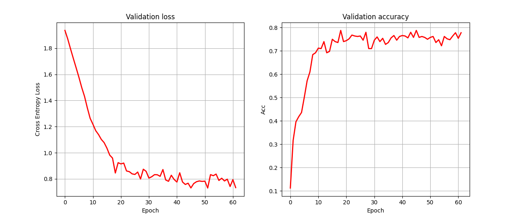

# GCN-Benchmark
SC4020 Project on GCN Algorithm Benchmarking 

### Project Details 

|                    | Description        |
| -------------------|:------------------:|
| Model Architecture | 2-GCN Layer        | 
| Loss Function      | CrossEntropy Loss  |  
| Optimizer          | Adam Optimizer     | 


### Setting up Environment 
```
py -3.8 -m venv venv
venv/Scripts/Activate 
pip install -r requirements.txt 
```


### Results 
| Test Loss          | Test accuracy      |
| -------------------|:------------------:|
| 0.670              | 0.82               | 



